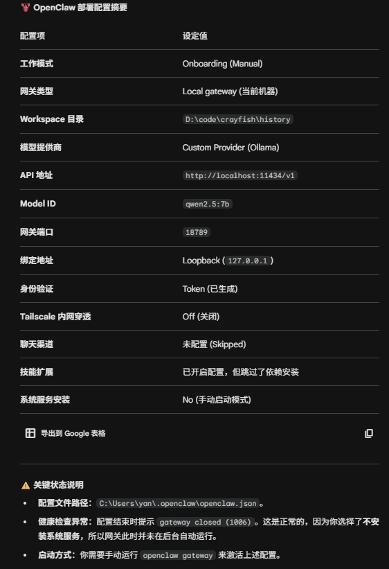

# 本地运行
需要安装Node.js和ollama两个软件，（可能还有git）
## 中文社区
> https://clawd.org.cn/#install

与官方版本比较略有延后
## 国际版
### Node.js
> https://nodejs.org/zh-cn/download

安装使用npm的长期支持版
验证是否成功
> npm -v
### ollama
> https://ollama.com/download

ollma提供大模型,
一般使用qwen2.5:7b 

下载并测试
> ollama run qwen2.5:7b

测试成功后，设置上下文

设置上下文至少16k(openclaw官方建议32k至少)

### 安装openclaw
运行安装命令
> npm install -g openclaw@latest

进入配置界面
> openclaw onboard
配置界面每天都会更新，建议是直接翻译问问ai。
记得一定保存令牌即可 形似：http://---/#token=------

### openclaw配置

后面是配置时候的问答：
|
o  I understand this is personal-by-default and shared/multi-user use requires lock-down. Continue?

|  Yes

|
o  Onboarding mode

|  Manual
|

o  What do you want to set up?

|  Local gateway (this machine)
|

o  Workspace directory

|  D:\code\crayfish\history
|

o  Model/auth provider

|  Custom Provider
|

o  API Base URL

|  http://localhost:11434/v1
|

o  How do you want to provide this API key?

|  Paste API key now
|

o  API Key (leave blank if not required)

|  ollama
|

o  Endpoint compatibility

|  OpenAI-compatible
|

o  Model ID

|  qwen2.5:7b
|

o  Verification successful.
|

o  Endpoint ID

|  custom-localhost-11434
|

o  Model alias (optional)

|  qwen2.5:7b
Configured custom provider: 

custom-localhost-11434/qwen2.5:7b
|

o  Gateway port

|  18789
|

o  Gateway bind

|  Loopback (127.0.0.1)
|

o  Gateway auth

|  Token
|

o  Tailscale exposure

|  Off
|

o  How do you want to provide the gateway token?

|  Generate/store plaintext token
|

o  Gateway token (blank to generate)

|
|
o  Channel status ----------------------------+
|                                             |
|  Telegram: needs token                      |
|  WhatsApp (default): not linked             |
|  Discord: needs token                       |
|  Slack: needs tokens                        |
|  Signal: needs setup                        |
|  signal-cli: missing (signal-cli)           |
|  iMessage: needs setup                      |
|  imsg: missing (imsg)                       |
|  IRC: not configured                        |
|  Google Chat: not configured                |
|  LINE: not configured                       |
|  Feishu: install plugin to enable           |
|  Google Chat: install plugin to enable      |
|  Nostr: install plugin to enable            |
|  Microsoft Teams: install plugin to enable  |
|  Mattermost: install plugin to enable       |
|  Nextcloud Talk: install plugin to enable   |
|  Matrix: install plugin to enable           |
|  BlueBubbles: install plugin to enable      |
|  LINE: install plugin to enable             |
|  Zalo: install plugin to enable             |
|  Zalo Personal: install plugin to enable    |
|  Synology Chat: install plugin to enable    |
|  Tlon: install plugin to enable             |
|                                             |
+---------------------------------------------+
|

o  Configure chat channels now?

|  No
Updated ~\.openclaw\openclaw.json
Workspace OK: D:\code\crayfish\history
Sessions OK: ~\.openclaw\agents\main\sessions
|

o  Web search ----------------------------------------+
|                                                     |
|  Web search lets your agent look things up online.  |
|  Choose a provider and paste your API key.          |
|  Docs: https://docs.openclaw.ai/tools/web           |
|                                                     |
+-----------------------------------------------------+
|

o  Search provider

|  Skip for now
|

o  Skills status -------------+
|                             |
|  Eligible: 3                |
|  Missing requirements: 40   |
|  Unsupported on this OS: 8  |
|  Blocked by allowlist: 0    |
|                             |
+-----------------------------+
|

o  Configure skills now? (recommended)

|  Yes
|

o  Install missing skill dependencies

|  Skip for now
|
o  Set GOOGLE_PLACES_API_KEY for goplaces?

|  No
|
o  Set GEMINI_API_KEY for nano-banana-pro?

|  No
|
o  Set NOTION_API_KEY for notion?

|  No
|
o  Set OPENAI_API_KEY for openai-image-gen?

|  No
|
o  Set OPENAI_API_KEY for openai-whisper-api?

|  No
|
o  Set ELEVENLABS_API_KEY for sag?

|  No
|

o  Hooks ------------------------------------------------------------------+
|                                                                          |
|  Hooks let you automate actions when agent commands are issued.          |
|  Example: Save session context to memory when you issue /new or /reset.  |
|                                                                          |
|  Learn more: https://docs.openclaw.ai/automation/hooks                   |
|                                                                          |
+--------------------------------------------------------------------------+
|

o  Enable hooks?

|  Skip for now

Config overwrite: C:\Users\yan\.openclaw\openclaw.json (sha256 fd250107942e5574993b6c75fb3177cdd20ed1127dbc6d64b0161b96327c25ba -> c41535e34a7408831540a9e54fbe5dcdf16f9e26d5e02f5a16d5b65bde9b21c1, backup=C:\Users\yan\.openclaw\openclaw.json.bak)
|

o  Install Gateway service (recommended)

|  No
|

o
Health check failed: gateway closed (1006 abnormal closure (no close frame)): no close reason
  Gateway target: ws://127.0.0.1:18789
  Source: local loopback
  Config: C:\Users\yan\.openclaw\openclaw.json
  Bind: loopback
|

o  Health check help --------------------------------+
|                                                    |
|  Docs:                                             |
|  https://docs.openclaw.ai/gateway/health           |
|  https://docs.openclaw.ai/gateway/troubleshooting  |
|                                                    |
+----------------------------------------------------+
|

o  Optional apps ------------------------+
|                                        |
|  Add nodes for extra features:         |
|  - macOS app (system + notifications)  |
|  - iOS app (camera/canvas)             |
|  - Android app (camera/canvas)         |
|                                        |
+----------------------------------------+
|
o  Control UI -------------------------------------------------------------------------------+
|                                                                                            |
|  Web UI: http://******/                                                           |
|  Web UI (with token):                                                                      |
|  http://********/#token=********            |
|  Gateway WS: ws://127.0.0.1:18789                                                          |
|  Gateway: not detected (gateway closed (1006 abnormal closure (no close frame)): no close  |
|  reason)                                                                                   |
|  Docs: https://docs.openclaw.ai/web/control-ui                                             |
|                                                                                            |
+--------------------------------------------------------------------------------------------+
|

o  Workspace backup ----------------------------------------+
|                                                           |
|  Back up your agent workspace.                            |
|  Docs: https://docs.openclaw.ai/concepts/agent-workspace  |
|                                                           |
+-----------------------------------------------------------+
|
o  Security ------------------------------------------------------+
|                                                                 |
|  Running agents on your computer is risky — harden your setup:  |
|  https://docs.openclaw.ai/security                              |
|                                                                 |
+-----------------------------------------------------------------+
|

Enable zsh shell completion for openclaw?
|  > Yes /   No

