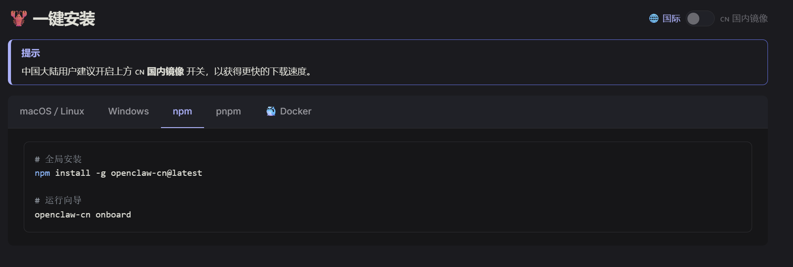
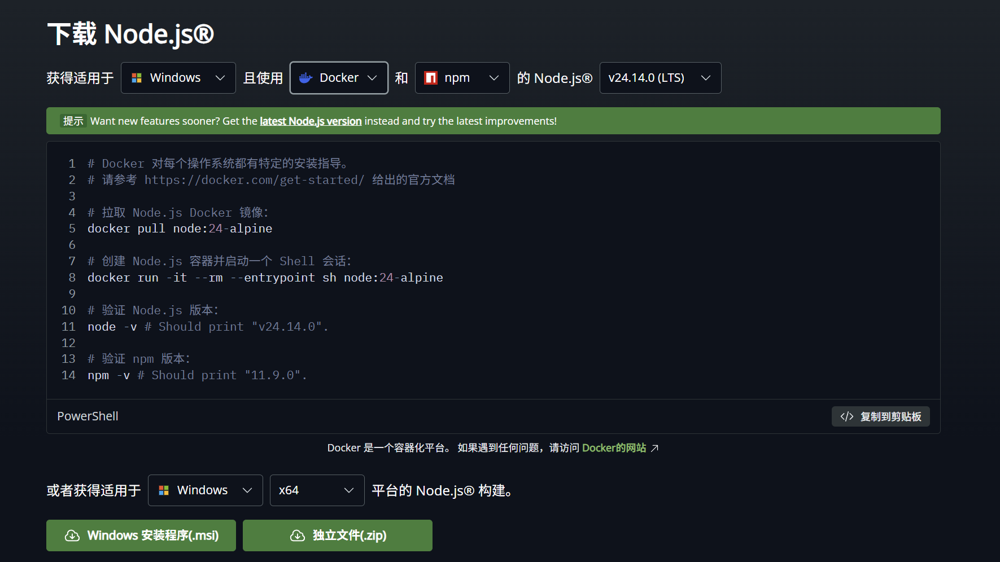
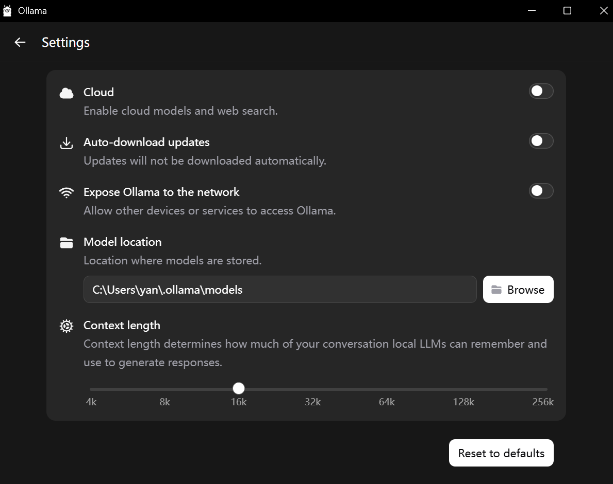

# 本地运行
需要安装Node.js和ollama两个软件即可
## 中文社区
> https://clawd.org.cn/#install

与官方版本比较略有延后
## 国际版
### Node.js
> https://nodejs.org/zh-cn/download

安装使用npm的长期支持版

### ollama
> https://ollama.com/download

ollma提供大模型,
一般使用qwen2.5:7b 

下载并测试
> ollama run qwen2.5:7b

测试成功后，设置上下文

设置上下文至少16k(openclaw官方建议32k至少)

### 安装openclaw
运行安装命令
> npm install -g openclaw@latest

进入配置界面
> openclaw onboard
配置界面每天都会更新，建议是直接翻译问问ai。
记得一定保存令牌即可 形似：http://---/#token=------

